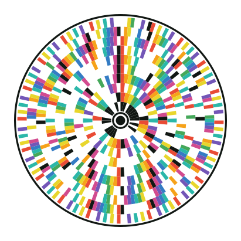

# RoBCode Studio

<p align="center">
  
  <br>
  <sub>A real RoBCode 2 symbol encoding the UTF-8 text <code>RoBCode 2</code>.</sub>
</p>

RoBCode Studio creates and decodes circular **Rings of Bytes Codes** in the
browser. It combines two related formats:

- **RoBCode 2** is a specified, self-contained barcode with orientation,
  checksums, parity, and Reed-Solomon error correction.
- **Legacy RoBCode** preserves the configurable generative artwork and the
  behavior of the original implementations.

The application is written in plain HTML, CSS, and object-oriented JavaScript.
It has no runtime dependencies and does not upload imported files.

> RoBCode 2 is currently a project-specific draft format, not an industry
> standard. Use a standardized barcode when interoperability with third-party
> scanners is required.

## Features

- Encode UTF-8 text as RoBCode 2.
- Export decodable SVG and lossless PNG files.
- Import, validate, and decode generated SVG files.
- Locate and decode lossless PNG symbols on rectangular or offset canvases.
- Recover arbitrary rotation and mirrored symbols from the synchronization
  ring.
- Rectify affine elliptical tilt and general projective keystone distortion.
- Correct damaged bytes with shortened RS(255,223) codewords.
- Report corrected symbols, parity warnings, payload size, and outer ring.
- Retain the original linear, exponential, colored, and unrolled Legacy modes.

## Quick start

No build step or package installation is required. Open `index.html` in a
modern browser, or serve the repository as static files:

```sh
python -m http.server 8000
```

Then open `http://localhost:8000`.

In **RoBCode 2** mode:

1. Enter text and choose the module size and colors.
2. Select **Draw RoBCode**.
3. Export the symbol with **Download SVG** or **Download PNG**.
4. Drop a generated SVG or lossless PNG into the decoder panel to verify and
   recover its payload.

The decoder operates locally in the browser. Imported files are limited to
64 MiB by the application.

## Reliable PNG decoding

The PNG sampler automatically handles:

- rotation and mirroring;
- extra margins and an off-center symbol;
- rectangular images;
- cropping that leaves the complete outer frame intact;
- affine compression and rotated ellipses;
- projective horizontal and vertical keystone distortion;
- combinations of perspective, affine tilt, rotation, and mirroring.

For reliable results:

- use a lossless image with at least eight pixels per module;
- keep the continuous outer bounding ring complete;
- retain good contrast between every dark cell and the background;
- avoid blur, reflections, shadows, and extreme viewing angles;
- keep the projected ellipse axis ratio at or above the default limit of
  `0.35`.

The sampler fits the projected outer circle as a general ellipse. It then uses
the isolated center finder to recover the remaining projective component and
the synchronization ring to resolve rotation and direction. Extremely oblique,
incomplete, or low-contrast symbols are rejected rather than decoded as
guesses.

## RoBCode 2 at a glance

RoBCode 2 retains the visual character of the original artwork while adding
the information required for deterministic decoding:

- a center finder and locator ring;
- a fixed 36-cell synchronization ring;
- concentric data rings with nine visible cells per byte;
- MSB-first bytes, even parity, and `0xAA` whitening;
- a protected header containing format magic, flags, payload length, and CRCs;
- shortened RS(255,223) error-correction blocks;
- a continuous bounding ring and a defined quiet zone.

Data ring `r` contains `2r` bytes. The byte capacity through outer ring `R` is:

```text
capacity(R) = R(R + 1) - 2
```

The complete normative draft, including geometry, packet fields, CRC
parameters, correction rules, and decoding order, is in
[`docs/FORMAT.md`](docs/FORMAT.md). Machine-readable golden vectors are in
[`docs/test-vectors.json`](docs/test-vectors.json).

RoBCode 2 provides error detection and correction, not encryption,
authentication, or a digital signature.

## Project structure

| Path | Purpose |
|---|---|
| `index.html` | Studio markup and script loading |
| `style.css` | Responsive application styling |
| `app.js` | Object-oriented browser controller and file workflow |
| `lib/rob-code-v2.js` | RoBCode 2 encoder and Reed-Solomon encoder |
| `lib/rob-code-v2-svg.js` | Normative SVG renderer |
| `lib/rob-code-v2-decoder.js` | Cell decoder, validation, and error correction |
| `lib/rob-code-v2-svg-importer.js` | Strict generated-SVG validation and import |
| `lib/rob-code-v2-raster-sampler.js` | PNG localization, projective rectification, and sampling |
| `lib/rob-code.js` | Legacy encoder and renderer |
| `docs/FORMAT.md` | Normative RoBCode 2 draft specification |
| `docs/robcode-2-example.svg` | Decodable README example generated by the renderer |
| `scripts/generate-readme-example.js` | Reproducibly generates the README example SVG |
| `tests/` | Node test suite and golden-vector checks |
| `svg_arc.html`, `Old/` | Historical implementations and source material |

The encoder, renderers, importers, raster sampler, and UI controller are kept
as separate layers. Library files support both browser globals and CommonJS
imports.

## JavaScript API

Encode and decode an in-memory symbol with Node.js:

```js
const RoBCode2Encoder = require("./lib/rob-code-v2.js");
const RoBCode2Decoder = require("./lib/rob-code-v2-decoder.js");

const encoded = new RoBCode2Encoder().encodeText("Hello, rings!");
const decoded = new RoBCode2Decoder().decodeSymbol(encoded);

console.log(decoded.text); // Hello, rings!
```

Decode browser `ImageData` obtained from a PNG:

```js
const sampler = new RoBCode2RasterSampler();
const decoded = sampler.decodeImageData(imageData);

console.log(decoded.text);
console.log(decoded.rasterMetadata.projectionModel);
console.log(decoded.correctedSymbols);
```

The SVG renderer requires a writable SVG DOM element:

```js
const svg = document.querySelector("svg");
const renderer = new RoBCode2SvgRenderer(svg);

renderer.renderText("Hello, rings!", {
  moduleSize: 20,
  darkColor: "#111713",
  lightColor: "#ffffff"
});
```

See the tests for lower-level examples using cell arrays, ring arrays, binary
payloads, SVG source import, and raster diagnostics.

## Tests

Node.js 18 or newer is recommended. Run the complete dependency-free suite
from the repository root:

```sh
node --test
```

The suite covers golden format vectors, UTF-8 and binary round trips,
Reed-Solomon correction limits, SVG validation, raster localization,
affine/projective rectification, rotation, mirroring, PNG export, and UI
integration.

Regenerate the visual README example after intentional renderer changes:

```sh
node scripts/generate-readme-example.js > docs/robcode-2-example.svg
```

## Legacy format

Legacy mode is generative artwork, not the RoBCode 2 barcode profile. Its
configurable parameters include ring growth, sector layout, bit order, parity,
XOR masks, center designs, colors, and unrolled output. Those choices are not
self-describing, so a legacy image cannot generally be decoded without knowing
the exact settings used to create it.

For linear growth with `step_size` bytes per ring step:

```text
bytes in ring r = r * step_size
bytes through ring r = step_size / 2 * (r^2 + r)
```

For exponential growth with base `b`:

```text
bytes in ring r = b^r
bytes through ring r = b * (1 - b^r) / (1 - b)
```

The current Legacy studio calculates sectors first and can place multiple
bytes in a sector. With one byte per sector, its layout matches the historical
`svg_arc.html` version.

## History

The browser implementation descends from an earlier Python generator that
produced PostScript around 2013/2014, using `target_library.ps` and
`cardTemplate.ps` from Diego Lopez de Iping's TripCode generator, itself based
on work by Jeremy Henty.

The Python version reimplemented a C program from around 1985. That program
drew bytes as eight data bits plus parity on concentric tracks to help students
visualize disk storage on early Macintosh hardware. The circular byte patterns
also worked as distinctive computer-generated art, leading to the name
**RoBCode**.

The original project treated the patterns primarily as artwork. RoBCode 2 is
the later, explicitly specified and decodable profile built on that visual
language.

## License

See [`LICENSE`](LICENSE).
